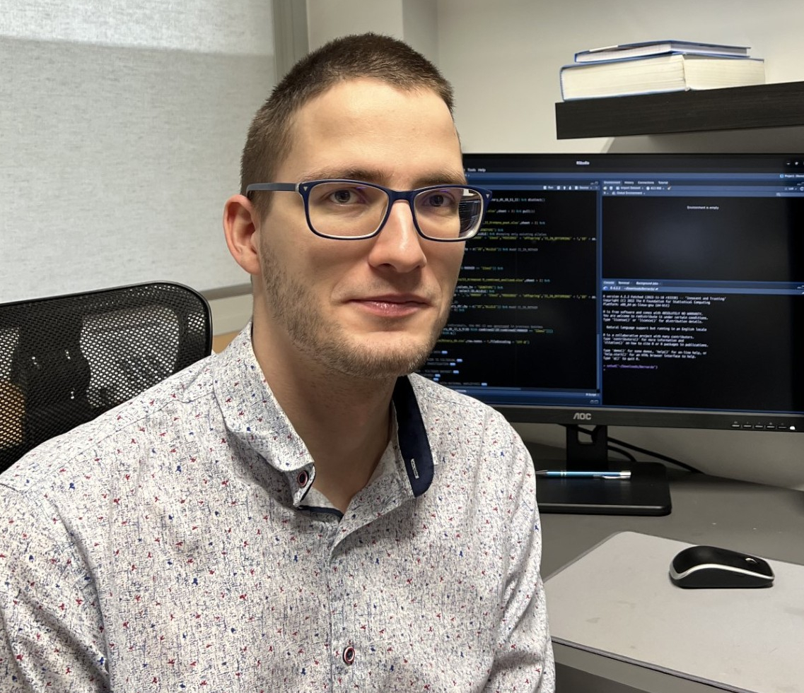

## Group Leader

- Guillem Ylla, Ph.D.

[ LinkedIn](https://www.linkedin.com/in/gylla)&nbsp;
[ GitHub](https://github.com/guillemylla)

---

## Postdocs

- Tomasz Gaczorek, Ph.D.

- Gabriela Machaj, Ph.D.

- Edossa Fikiru, Ph.D.

- Takahisa Yamashita, Ph.D.

---

## Ph.D. Students

- Rafał Miłodrowski, Ph.D. Student in Bioinformatics.

- Krystian Komenda, Ph.D. Student in Bioinformatics.

---

## Master Students

- Dominik Robak, Master Student in Bioinformatics.
- Szymon Szrajer, Master Student in Bioinformatics.

---

## Former Lab Members

- Sara Herrera, vising Ph.D. student (2021).
- Evgenii Baiakhmetov,  Visiting scientist (2022).
  * While in the lab, Evgenii developed a comprehensive [Genome assembly tutorial ]( https://niwdoog.github.io/Genome_Assembly_Long_Reads_Hi-C/)
- Michał Zawisza, visiting Ph.D. student from Barcelona University.

