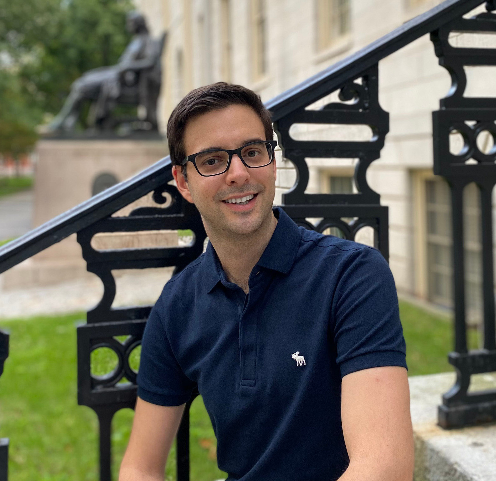
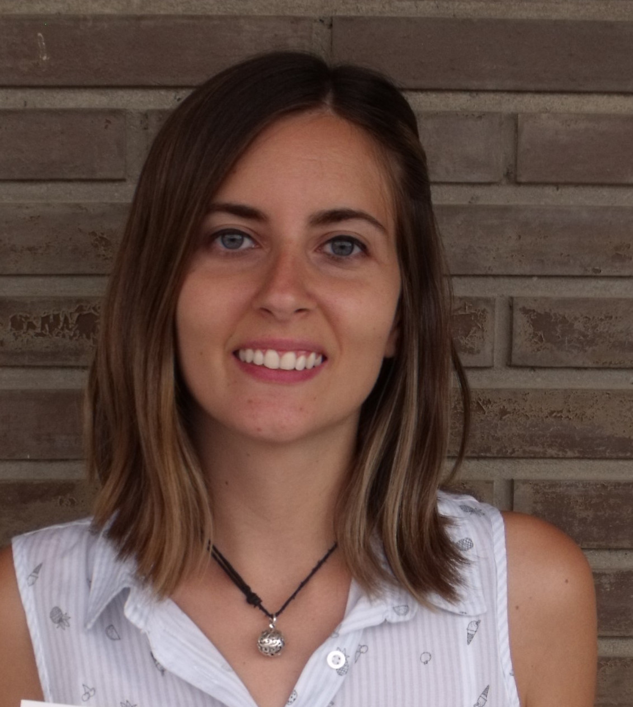

## Group Leader

- Guillem Ylla, Ph.D.

[ LinkedIn](https://www.linkedin.com/in/gylla)&nbsp;
[ GitHub](https://github.com/guillemylla)

---

## Postdocs

- Gabriela Machaj, Ph.D.

---

## Ph.D. Students

- Rafał Miłodrowski, Master Student in Bioinformatics

---

## Master Students

- Majka Karczmarek, Master Student in Bioinformatics

- Alexandra Lazar, Master Student in Bioinformatics

- Dominik Robak, Master Student in Bioinformatics

- Szymon Szrajer, Master Student in Bioinformatics

## Undergraduate Students

- Paulina Prygiel, Bachelor Student in Bioinformatics

## Visiting scientists

* Evgenii Baiakhmetov.
 * While in the lab, Evgenii developed a comprehensive [Genome assembly tutorial ]( https://niwdoog.github.io/Genome_Assembly_Long_Reads_Hi-C/)

---

## Former Lab Members

- Sara Herrera, Vising Ph.D. student
