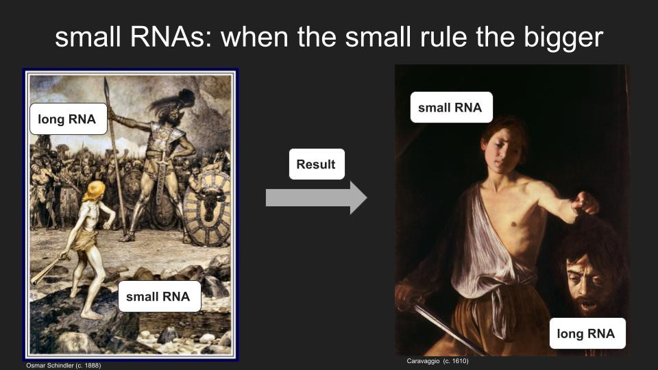

[More information here](https://winterschool.wbbib.uj.edu.pl/en_GB/)

Guillem Ylla gave a talk in the workshop titled “Omics research – from methodology to application” about the role of small RNAs controlling the expression of mRNAs. 
